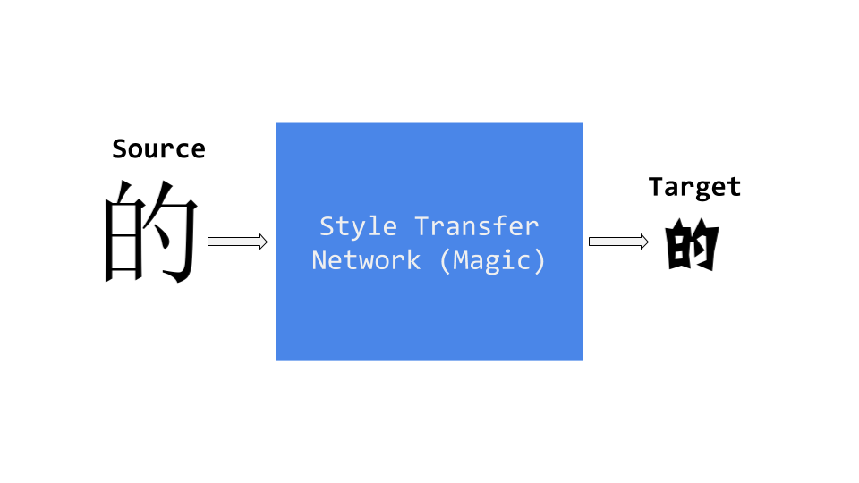
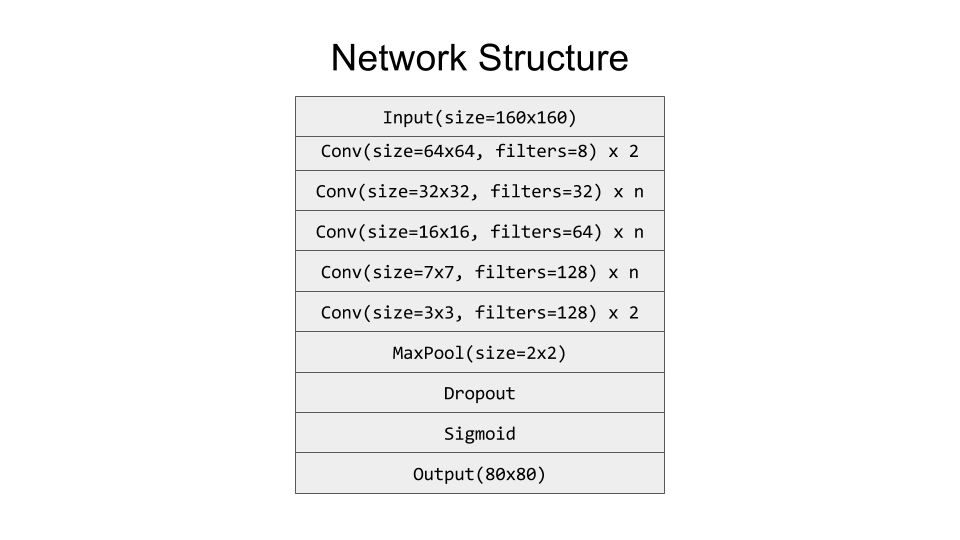

#Rewrite: Neural Style Transfer For Chinese Fonts
<p align="center">
  
</p>
## Motivation
Creating font is a hard business, creating a Chinese font is an even harder one. To make a GBK (a character set  standardized by Chinese government) compatible font, designers will need to design unique looks for more than 26,000 Chinese characters, a daunting effort that could take years to complete. 

What about the designer just creates a subset of characters, then let computer figures out what the rest supposed to look like? After all, Chinese characters are consisting of a core set of radicals(偏旁部首), and the same radical looks pretty similar on different characters. 

This project is an explorational take on this using deep learning. Specifically, the whole font design process is formulated as a style transfer problem from a standard look font, such as [SIMSUN](https://www.microsoft.com/typography/Fonts/family.aspx?FID=37), to an stylized target font. A neural network is trained to approximate the transformation in between two fonts given a subset of pairs of examples. Once the learning is finished, it can be used to infer the shape for the rest of characters. Box below illustrated this general idea:


This project is heavily inspired by the awesome blog [Analyzing 50k fonts using deep neural networks](https://erikbern.com/2016/01/21/analyzing-50k-fonts-using-deep-neural-networks/) from Erik Bernhardsson, and great paper [Learning Typographic Style](https://arxiv.org/pdf/1603.04000.pdf) from Shumeet Baluja. I also get a lot help from reading [Justin Johnson's](http://cs.stanford.edu/people/jcjohns/) awesome writeup on [his method for faster neural style transfer](http://cs.stanford.edu/people/jcjohns/papers/eccv16/JohnsonECCV16Supplementary.pdf)

## Network Structure
After trying various different architectures, including more sophisticated ones with residuals and deconvolution, I ended up a with a more traditional top-down CNN structure, as shown below.


### Notes & Observations: 
* Each Convolutional layer is followed by a Batch Normalization layer then a ReLu layer.
* The network is minimized against pixel wise **MAE**(Mean Absolute Error) between predicted output and ground truth, rather than than more commonly used **MSE**(Mean Square Error), as mentioned in Erik's blog. MAE tends to yield sharper and cleaner image, while MSE falls to more blurred and grayish ones. Also [total variation loss](https://en.wikipedia.org/wiki/Total_variation_denoising) is applied for image smoothness.
* Layer number **n** is configurable, the larger n tends to generate more detailed and cleaner output, but takes longer time to train, usual choice is 2 or 3.
* Big convolutions for better details. During my experiments, I started out using stacked straightup plain 3x3 convolutions, but it end up performing badly or not converging on more difficult and exotic fonts. So I end up this trickling down shape architecture, with various size of convolutions on different layers, each contains about the same number of parameters, so the network can capture details at different level.
* Dropout is essential for convergence. Without it, the network simply gives up or trapped in trivial solutions, like all white or black images.
* Fully-Connected layers used in both Erik and Shumeet's work didn't work very well for Chinese characters, generating noisier and unstable output. My guess is that Chinese characters are much more complex in structure and by nature closer to images than letters, so a CNN based approach makes more sense in this case.
* Unlike real world image, we can generate image of a character with arbitrary resolution. Knowing this, we can use a high-res source image to approximate a low-res target, thus more details are preserved and to avoid blurriness and noise.

##Visualizations & Applications
###Progress during training
The image on the top shows the progress of model made on validation set during training, on various fonts. All of the them are trained on 2000 examples with layer number set to 3. It is pretty interesting to see how the model slowly converges from random noise, to first capture the recognizable shape of a character, then to more nuanced details. Below is the progress captured for a single font during training.
<p align="center">
  
</p>
###Compare with ground truth
###How many characters are needed?
###From 3k to 26k
##Usage
###Requirements
To use this package, TensorFlow is required to be installed (tested on 0.10.0 version). Other python requirements are listed in the requirements.txt. Also a GPU is **highly** recommended, if you expect to see some results in reasonable amount of time. 

All experiments run on one Nvidia GTX 1080. For 3000 iterations with batch size 16, it takes the small model about 20 minutes to finish, while 90 minutes for the big one.
###Example
Prior to training, you need to run the preprocess script to generate character bitmaps for both source and target fonts:

```sh
python preprocess.py --source_font src.ttf \
                     --target_font tgt.otf \
                     --char_list charsets/top_3000_simplified.txt \ 
                     --save_dir path_to_save_bitmap
```
The preprocess script accept both TrueType and OpenType fonts, take a list of characters (some common charsets are builtin in the charsets directory in this repo, like the top 3000 most used simplified Chinese characters) then save the bitmaps of those characters in **.npy** format. By default, for the source font, each character will be saved with font size 128 on a 160x160 canvas, and target font with size 64 on 80x80 canvas, with respect.

After the preprocess step, assume you already have the bitmaps for both source and target fonts, noted as **src.npy** and **tgt.npy**, run the below command to start the actual training:

```sh
python rewrite.py --mode=train \ 
                  --model=big \
                  --source_font=src.npy \
                  --target_font=tgt.npy \ 
                  --iter=3000 \
                  --num_examples=2100 \
                  --num_validations=100 \
                  --tv=0.0001 \
                  --keep_prob=0.9 \ 
                  --num_ckpt=10 \
                  --ckpt_dir=path_to_save_checkpoints \ 
                  --summary_dir=path_to_save_summaries\
                  --frame_dir=path_to_save_frames
```
Some explanations here:

* **mode**: can be either *train* or *infer*, the former is self-explaintory, and we will talk about infer later.
* **model**: here represents the size of the model. *big* means **n=3**, while *small* for **n=2**
* **tv**: the weight for the total variation loss, default to 0.0001. If the output looks broken or jarring, you can choose to boost it to force the model to generate smoother output
* **keep_prob**: represents the probability a value passing through the Dropout layer during training. This is actually a very important parameter, the higher the probability, the sharper but potentially broken output is expected. If the result is not good, you can try to lower value down, for a noiser but rounder shape. Typical options are 0.5 or 0.9.
* **ckpt_dir**: the directory to store model checkpoints, used for latter inference step.
* **summary_dir**: if you wish to use TensorBoard to visualize some metrics, like loss over iterations, this is the place to save all the summaries. Default to /tmp/summary. You can check the loss for training batch, as well as on validation set, and the breakdown of it.
* **frame_dir**: the directory to save the captured output on **validation** set. Used to pick the best model for inference. After the training, you can also find a file named **transition.gif** to show you the animated progress the model made during training, also on validation set.

For other options, you can use the **-h** checkout the exact usage case.

Suppose we finish training (finally!), now we can use the **infer** mode mentioned previously to see how the model is doing on unseen characters. You can refer to the captured frames in the frame_dir to help you pick the model that you are most satisfied with (it is usually not the one with least error). Run the following command

```sh
python rewrite.py --mode=infer \
                  --model=big \
                  --source_font=src.npy \
                  --ckpt=path_to_your_favorite_model_checkpoints \
                  --bitmap_dir=path_to_save_the_inferred_output
```
Note the source_font can be different from the one used in training. In fact, it can even be any other font. But it is better to choose the same or similar font for inference for good output. After the inference, you will find series of images for all output characters and a npy file that contains the inferred character bitmaps.

## Discussion & Future Work
This project started out as a personal project to help me learning and understanding TensorFlow, but ended up something more interesting, that I think worthy sharing with more people. 

Currently, the network can only manage to learn one style at a time, it will be interesting to see how to handle multiple styles at once. 2000 characters are fewer than 10% of the complete GBK sets, but it is still a lot of characters, is it possible to learn style with something fewer than 100 characters? My guess is GAN(Generative Adversarial Network) could be really useful to try for this purpose.

On network design, this architecture is proven effective, but what is the optimal number of layers for each size of convolutions remains to be figured out, or whether some convolution layers are necessary.

Another interesting direction I would love to explore is create font with mixed styles. Simply combining two fonts in the loss function didn't work well. Potentially more novel change in network design is required to tackle this.

## LICENSE
GPLv3